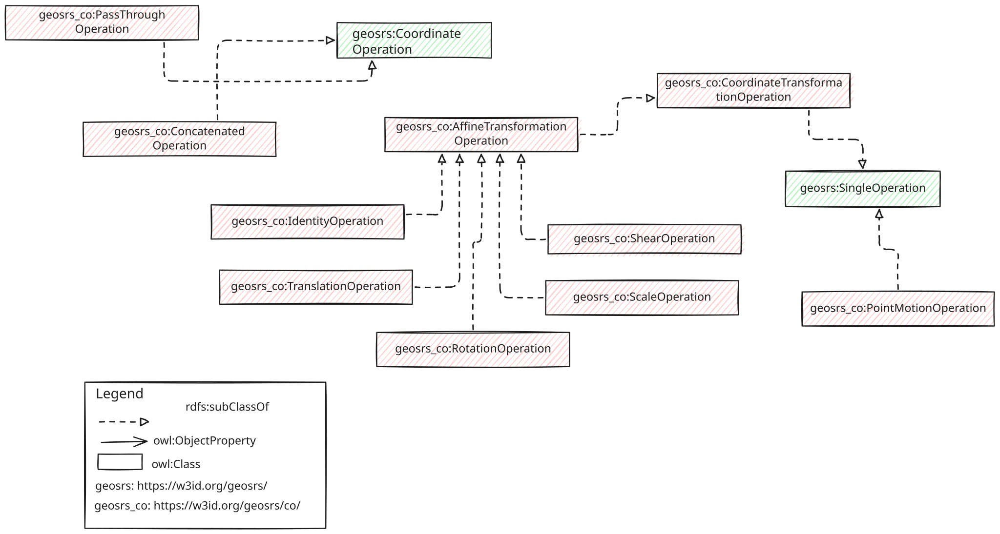

## SRS Ontology Coordinate Operation Module

This module describes how to model a coordinate operation using the SRS ontology vocabulary.

Coordinate Operation classes and properties are described under the namespace https://w3id.org/geosrs/co/

Coordinate operations are mathematical methods that transform coordinates from one reference system to another. There are three main families: `geosrs:PassThroughOperation`, `geosrs:ConcatenatedOperation`, `geosrs:SingleOperation`, with only the latter featuring in the Core module. A concatenated operation is a sequence of single operations, all applied on the same reference system. In contrast, a single operation is a non-concatenated method, transforming coordinates in a single step. `geosrs:PassThroughOperation` narrows down the operation to a sub-set of the coordinates tuple.

The `geosrs:SingleOperation` specialises further into three sub-types: `geosrs:PointMotion`, `geosrs:Transformation` and `geosrs:Conversion`. Except for `geosrs:PointMotion` all of these classes are included in the Core module. A Conversion operation translates coordinates between two reference systems defined on the same datum. In its turn, a Transformation translates coordinates between reference systems defined on different datums. A conversion tends to be a direct mathematical function with no uncertainty associated. A transformation is often defined on non-finite methods and implies a relevant uncertainty in its result. A point motion represents a change of coordinates values within the same coordinate system but between different time epochs. Point motions are usually caused by tectonic movements.

Within the Coordinate Operation module the `geosrs:Transformation` operation is further specialised by the `geosrs:AffineTransformation` class. The latter is further specialised with narrower operations: `geosrs:Scale`, `geosrs:Rotation`, `geosrs:Identity`, `geosrs:Shear` and `geosrs:Translation`.
