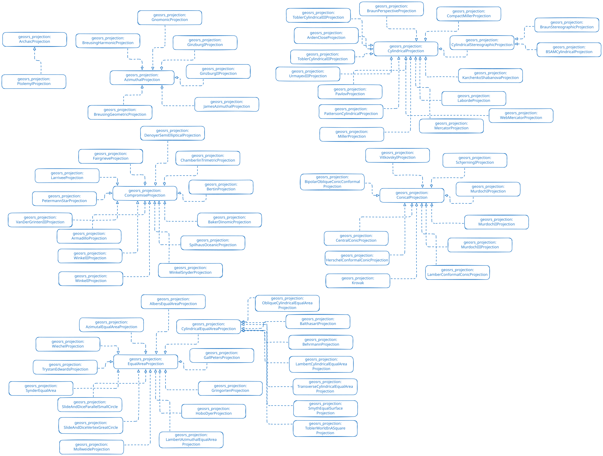

## SRS Ontology Projection Module

This module describes how to model a projection system using the SRS ontology vocabulary.

Projection classes and properties are described under the namespace https://w3id.org/geosrs/projection/

A map projection is a specific set of transformations which are used to represent the two-dimensional surface of a globe on a map plane. All map projections are therefore specific coordinate transformations in the sense of the coordinate operation module.

This module does not describe the specific parameters of a map projection because many variants of a map projection with different parameter usage might exist. Rather we describe the classes to specify the type of projection. Parameter values of the projection type will have to be initialized when instances of the projection class are created.
