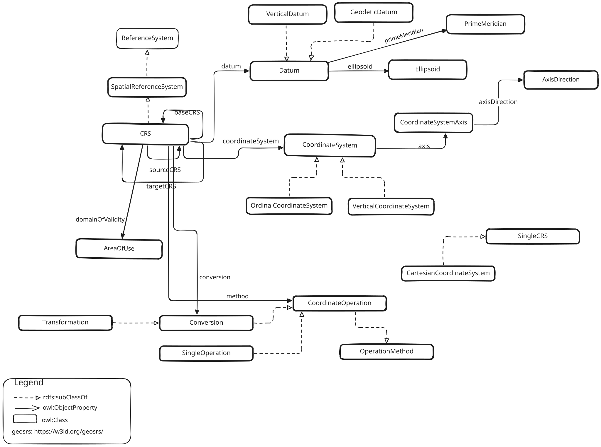

## SRS Ontology Core Module

This module describes how to use the SRS ontology core vocabulary.

Classes and properties are described under the namespace https://w3id.org/geosrs/srs/

The Core module establishes a set of classes and properties which define the building blocks of a spatial reference system definition. Some of the definitions are extended in specialized modules related to the Core module.

From a base class `SpatialReferenceSystem`, a class for a coordinate reference system is subtyped. `CoordinateReferenceSystem` is the superclass of all spatial reference systems describing locations using coordinates. The latter are described using a `Datum` and a `CoordinateSystem` definition with at least one instance of `CoordinateAxis`. Together with several subtypes of `CoordinateReferenceSystem`, these definitions complete the Core module.
